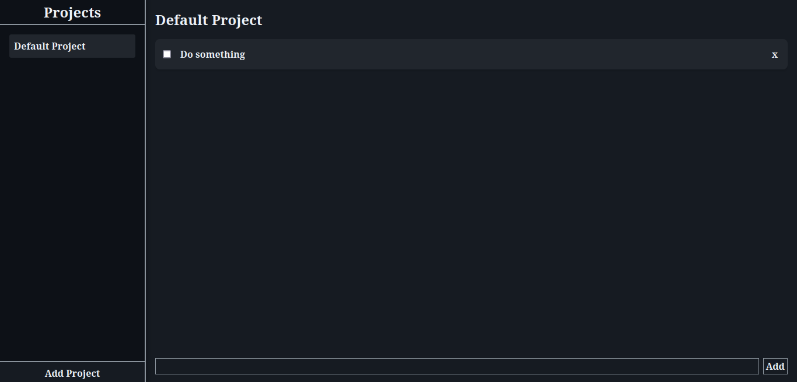

# Todo List
A small task-based application as a practical project for webpack, javascript modules and localstorage, of course, following the course of [The Odin Project](https://theodinproject.com/).

## Live Demo:

### Issues:
It has a small issue in the mobile version, a strange behavior when trying to add projects, the rest, all good, in the future I plan to fix it... or maybe I will forget it HAHAHAHA.
